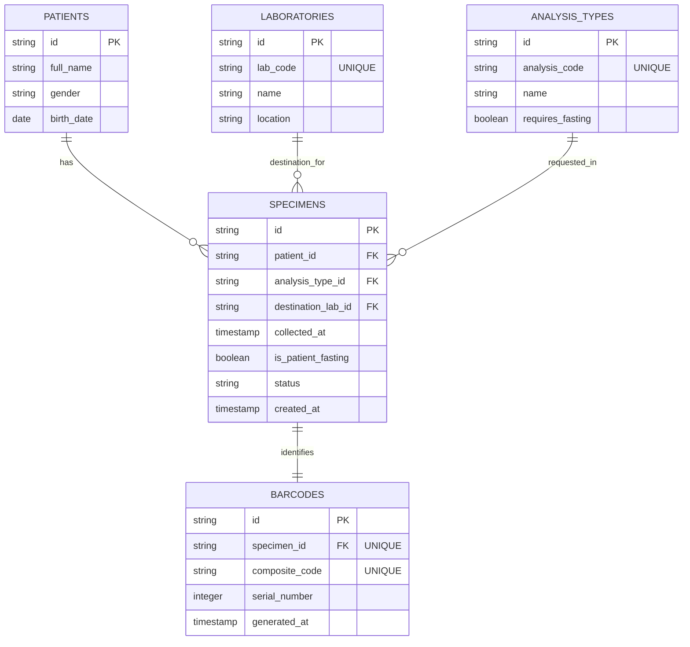

```mermaid
erDiagram
    PATIENTS ||--o{ SPECIMENS : "has"
    LABORATORIES ||--o{ SPECIMENS : "destination_for"
    ANALYSIS_TYPES ||--o{ SPECIMENS : "requested_in"
    SPECIMENS ||--|| BARCODES : "identifies"

    PATIENTS {
        string id PK
        string full_name
        string gender
        date birth_date
    }

    LABORATORIES {
        string id PK
        string lab_code "UNIQUE"
        string name
        string location
    }

    ANALYSIS_TYPES {
        string id PK
        string analysis_code "UNIQUE"
        string name
        boolean requires_fasting
    }

    SPECIMENS {
        string id PK
        string patient_id FK
        string analysis_type_id FK
        string destination_lab_id FK
        timestamp collected_at
        boolean is_patient_fasting
        string status
        timestamp created_at
    }

    BARCODES {
        string id PK
        string specimen_id FK "UNIQUE"
        string composite_code "UNIQUE"
        integer serial_number
        timestamp generated_at
    }
```
