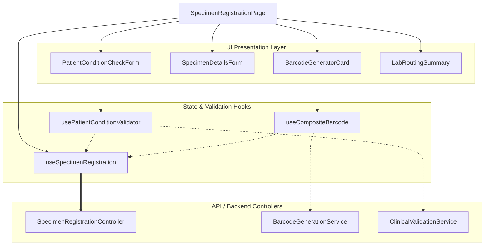

```mermaid

graph TD
    Page[SpecimenRegistrationPage]
    
    subgraph UI_Components [UI Presentation Layer]
        PatientCheckForm[PatientConditionCheckForm]
        SpecimenDetailsForm[SpecimenDetailsForm]
        BarcodeGenerator[BarcodeGeneratorCard]
        AutomationSummary[LabRoutingSummary]
    end

    subgraph Logic_Layer [State & Validation Hooks]
        useRegistration[useSpecimenRegistration]
        useConditionValidator[usePatientConditionValidator]
        useBarcode[useCompositeBarcode]
    end

    subgraph Backend_Controllers [ API / Backend Controllers]
        RegController[SpecimenRegistrationController]
        BarcodeService[BarcodeGenerationService]
        ValidationService[ClinicalValidationService]
    end

    Page --> PatientCheckForm
    Page --> SpecimenDetailsForm
    Page --> BarcodeGenerator
    Page --> AutomationSummary

    Page --> useRegistration
    PatientCheckForm --> useConditionValidator
    BarcodeGenerator --> useBarcode

    useConditionValidator -.-> useRegistration
    useBarcode -.-> useRegistration

    useRegistration ==> RegController
    useBarcode -.-> BarcodeService
    useConditionValidator -.-> ValidationService

```
